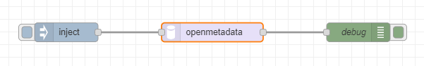
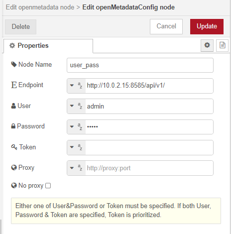
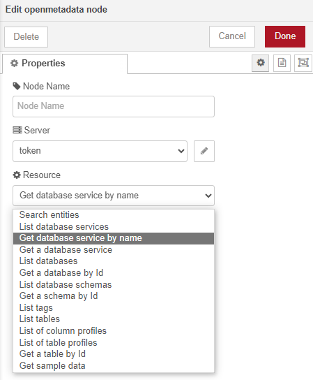
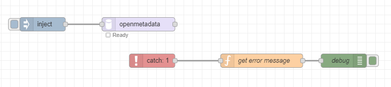
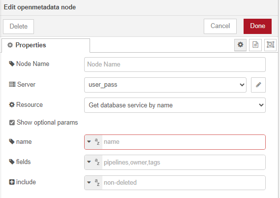
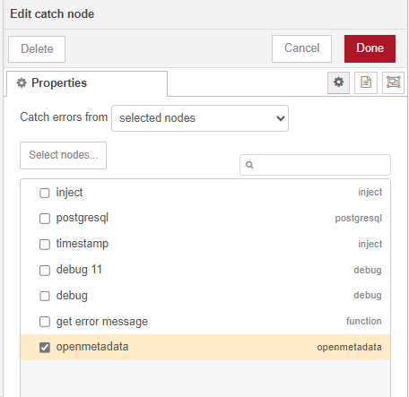
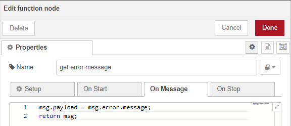
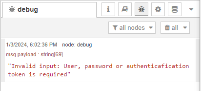
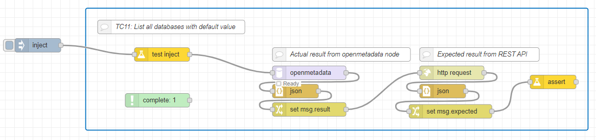

## Introduction

**node-red-openmetadata** is a Node-RED node to request to OpenMetadata by Rest API.

There are two nodes:
- `OpenMetadata Config Node`: manage connections by loging into OpenMetadata and get an access token.
- `OpenMetadata Node`: call OpenMetadata API by requests.

## Prerequisites

**node-red-openmetadata** requires the following items to be installed.

1. [Node-RED](https://nodered.org/) version 3.1.0 or higher
2. OpenMetadata version 1.2.0

## Installation

1. Node-RED installation guide can be found [here](https://github.com/node-red/node-red)

2. Prepare the source code and move to `node-red-openmetadata` directory in a terminal.

3. Move to the user data directory of Node-RED (default is $HOME/.node-red) and then install node-red-openmetadata:

    `npm install [path to node-red-openmetadata]`

4. Start Node-RED: `node-red`

5. Open Node-RED on a browser. Example: http://127.0.0.1:1880

## Guidelines how to use node-red-openmetadata

1. On the Node-RED flow editor, draw the following flow.



2. Double click on the openmetadata node to set configuration information to connect to OpenMetadata server. In Server input, select `Add new openMetadataConfig..` and pencil symbol to set the configuration for OpenMetadata Config node as following:



   In which:
* `Node Name`: Name of OpenMetadata Config node.
* `Endpoint`: Endpoint of OpenMetadata server.
* `User, Password, Token`: Necessary parameters  to login to OpenMetadata server.
Either user & password or token is required. If user & password is specified, OpenMetadata node calls Login API to get token.  If token is specified, OpenMetadata node uses it without calling Login API. If both user, password and token are entered, token is prioritized.
* `Proxy, No proxy`: Options for curl to access web resource.
Proxy/No proxy: The proxy field is hidden if "no proxy" option is checked. If No proxy is checked, the proxy is not used. If No proxy is not checked and proxy is specified, the proxy is used. If no proxy is not checked and proxy is not specified, the proxy value follows OS' setting (environment variable).

  After configuration for OpenMetada Config Node, Click Add button to save it. 

3. Click to Resource input to show a 14 APIs dropdown list supported and choose one of them as following:



4. Click `Show optional params` to show optional parameters of selected API or not.

5. Fill in the values corresponding to each parameter.

6. Click Deploy on the Node-RED editor.

7. Click on the button of the `inject` node.

8. Open the Debug tab to see the result.


## Error messages

In case of error, the openmetadata node will report error to the runtime, user can use Catch node to catch the error messages.
1. If the user does not configure OpenMetadata Config Node, the following error message will be reported.
```
openMetadataConfig node is not configured.
```

2. In case the user does not enter a token, nor the username or password, the following error message will be reported.
```
Invalid input: User, password or authenticafication token is required'.
```

3. If the user does not choose the resource input, the following error message will be reported.
```
API is not selected.
```

4. In case the user chooses Search entites API, if user enter wrong format of an input, the following error message will be reported.
```
include_source_fields must be the following array form ["value1", "value2", ...]
```

### Catch node

1.  Create the following flow with the Catch node.



2. Double click on the openmetadata node to set an invalid input.



3. Double click on the Catch node to select openmetadata node that Catch node will catch error message.



4. Double click on Function node to get error message:



5. Click on the button Deploy on the editor, then click on the Inject node. The message object is shown on the Debug tab, then user can find the error message.



## Testing

node-red-openmetadata is tested with PGSpider, PostgreSQL 16.0 and OpenMetadata version 1.2.0.

Prepare testing: Execute `init.sh` script in `node-red-openmetadata/test/` folder to initilize data and start dockers.

The test suite requires the following packages installed
[node-red-contrib-flowtest](https://github.com/steineey/node-red-contrib-flowtest)

On the Node-RED editor import the test flow located at test/list_database.json.
1. Press Ctrl+i to open Import nodes interface
2. Select list_database.json and click the button Import.

On the flow editor, configure openmetadata node to connect to OpenMetadata server and do the following steps.
1. Prepare test data on OpenMetadata
2. Execute each test by clicking on "inject" in each test case. The test result OK/Not OK is displayed on assert node.



## Copyright and license

Copyright Toshiba Corporation under [the Apache 2.0 license](LICENSE).
